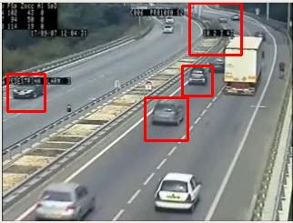
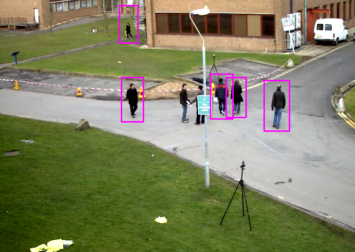
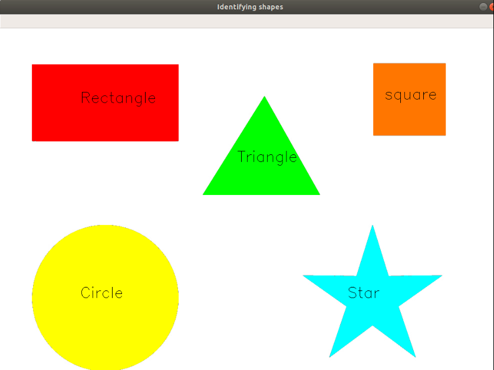
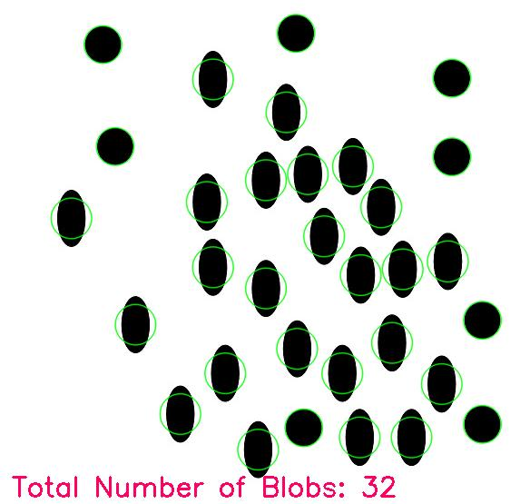

## Opencv basic projects in c++ and python

### Cplusplus_opencv

   1. [C++ programs for opencv - Basics](https://github.com/ajithvallabai/opencv_projects/tree/master/C%2B%2B/basics)
### Python_opencv
    
Projects

  1. [Live webcam sketch](https://github.com/ajithvallabai/opencv_projects/tree/master/python/Live_webcam_sketch) 
   
   2. [Contour_detection](https://github.com/ajithvallabai/opencv_projects/tree/master/python/Contour_detection)
   3. [Counting_circles_and_ellipses](https://github.com/ajithvallabai/opencv_projects/tree/master/python/Counting_circles_and_ellipses)
   4. [Template_matching](https://github.com/ajithvallabai/opencv_projects/tree/master/python/Template_matching)
   5. Object detection

      a.[Face_eye_smile_detection](https://github.com/ajithvallabai/opencv_projects/tree/master/python/object_detection/eye_and_face_detection)

      b.[Yolo_object_detection](https://github.com/ajithvallabai/opencv_projects/tree/master/python/object_detection/yolo_object_detection)
   6. Car and Pedestrain detection

      a.[Car_detection](https://github.com/ajithvallabai/opencv_projects/tree/master/python/car_and_pedestrian_detection)

      b.[Pedestrian_detection](https://github.com/ajithvallabai/opencv_projects/tree/master/python/car_and_pedestrian_detection)
   7. [Face_swap](https://github.com/ajithvallabai/opencv_projects/tree/master/python/face_swap)
   8. [Yawn_detector](https://github.com/ajithvallabai/opencv_projects/tree/master/python/yawn_detection)

   Package used:
   
      Opencv 4.1.1

Gallery :

